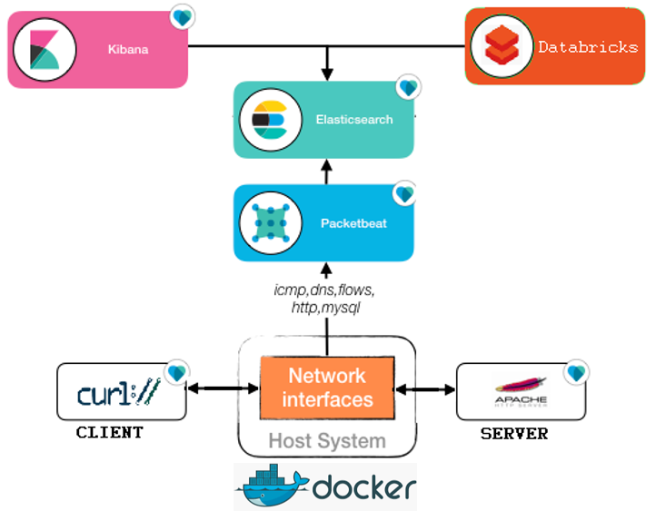

# Docker ELK PacketBeat with FileTransfer Simulation

Create docker containers with HTTP Server and client simulating file transfer.
 
## Run
```bash
$ git clone git@github.com:gustavofleury/docker_ELK_PacketBeat_FileTransfer.git
$ docker-compose up
```

## Versions

Elastic components (ES, Kibana, PacketBeat ) are version 5.5.1

## Architecture 

The following illustrates the architecture deployed by the compose file. 



Summarising the above, the following containers are deployed:

* `HTTP Server` - Small HTTP server containing some files to simulate;
* `Elasticsearch` - Database;
* `Kibana` - Visualization for captured logs; 
* `Packetbeat` - Monitoring communication between all containers with respect to http file transfers.
* `CURL Cliet` - Repeatly download files from HTTP Server;

1. Ensuring the following ports are free on the host, as they are mounted by the containers:

    - `80` (HTTP Server)
    - `5601` (Kibana)
    - `9200` (Elasticsearch)

1. Packetbeat, capturing network traffic:
    - `dns` - port `53`
    - `http` - ports `9200`, `80`, `8080`, `8000`, `5000`, `8002`, `5601`
    - `icmp`


## REFERENCES

1. https://www.docker.elastic.co/
1. https://github.com/elastic/examples/tree/master/Miscellaneous/docker/full_stack_example
